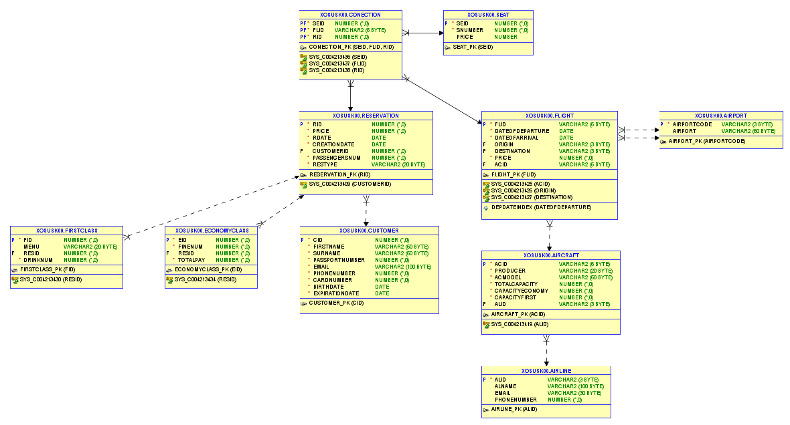
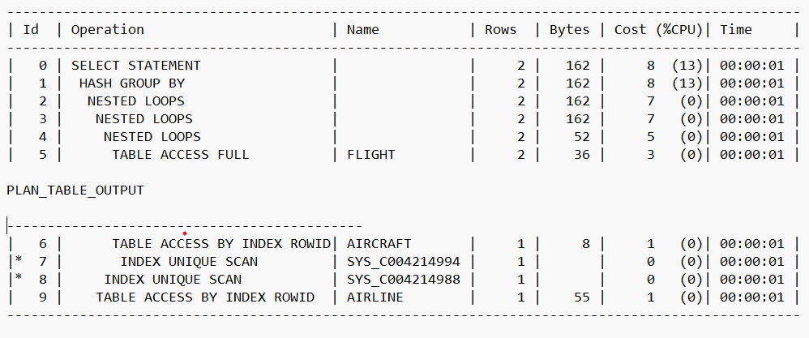
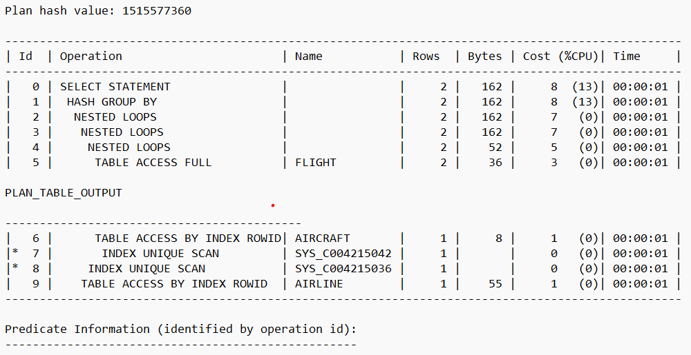

# Project documentation Projeckt IDS -- 4 část

Fakulta informačních technologií 
Tým: xosusk00 
Vysoké učení technické v Brně
Jan Osuský -- xosusk00

## TABLE OF CONTENT:
Design diagram ..........................................................................3 \
Introduction................................................................................4\
Solution description...................................................................4\
Description of trigger................................................................5\
Descrition of procedure.............................................................5\
Description of materialized view..............................................6\
Description of complex SELECT.................................................6\
Description of INDEX and EXPLAIN PLAN.................................7

## Design diagram:

{width="8.243055555555555in"
height="4.443054461942257in"}

## Introduction:

In this project documentation, we will describe the design and
implementation of a database for an airline, the last part of the
project to IDS. The database was designed with the needs of the airline
in mind, according to the assignment from the IUS subject, and includes
tables for customers, flights, aircraft, seats, airports and other
relevant information. In the documentation, we will describe individual
tables, including key properties and limitations, as well as the\
implementation of data tables. As part of the project, we also created
several queries, procedures and triggers that are used to manage data in
the database efficiently and securely.

## Solution description:

.In this project I created a database design for an airline in an
individual plan. Based on the requirements of the assignment, I designed
an entity-relational model, which I further elaborated and optimized. I
created tables to store data about planes, flight schedules, passengers,
tickets and other necessary\
information. Each table contains keys that enable connections with other
tables, as well as columns for storing specific information.

To create the database, I used the SQL language and the PL/SQL
relational database system. To ensure data security, I designed user
access rights and data input security using input validation and data
type restrictions

## Description of trigger:

The first trigger named incrementReservationId is used to automatically
increment the rId value before inserting a new reservation into the
reservation table. This trigger fires before each new row is inserted
and uses the MAX function to find the highest rId value in the
reservation table and then adds 1 for the new reservation.

The second trigger called checkPassportNumber is used to verify that the
customer\'s passport number does not already exist in the database for
another customer. This trigger is fired before each new row is inserted
into the customer

table. A SELECT query is used for this, which checks whether a customer
with the given passport already exists. If so, the error \"Passport
number already exists in the database.\" will be raised.

## Description of procedure:

The first procedure is called avgPassengersPerReservation and is used to
calculate the average number of passengers per reservation. In the first
part, a cReservations cursor is created, which returns the number of
passengers on each reservation in the reservation table. Then a for loop
is used to loop through each reservation in the cursor and store the
total number of\
passengers in the vTotalPassengers variable. At the same time, the total
number of reservations is calculated in the variable vReservationsCount.
If no reservations are found, the program displays the message \"No
reservations found.\" If reservations are found, the average number of
passengers per reservation is calculated and inserted into the
reservationStats table along with the current date.

The second procedure is called updateFlightPrice and is used to update
the flight price. This procedure takes two parameters - the flight ID
pFlightId and the new price pNewPrice. First, the flight row to be
updated is selected using the cFlight cursor. If the flight with the
given ID is not found, the procedure throws a NO_DATA_FOUND exception.
If a flight is found, the flight price is updated to the new price.
Finally, a price update message is displayed. If any other exception
occurs, the procedure outputs an empty message.

## Description of materialized view:

The implementation involves granting permissions to two users: xosusk00
and xosusk01. User xosusk00 was granted full access to all tables, as
was user xosusk01. User xosusk01 commented in the code because I\'m
alone in the team and it\'s just an improvisation on the solution. The
database does not know of any such user and the code will throw an
error. In general, a materialized view is a database object that stores
the result of a query and periodically updates it based on a specified
schedule. The materialized view stores the result of a query that
combines data from the customer and reservation tables of user xosusk00.
It is updated periodically based on the specified REFRESH COMPLETE
schedule and will be updated after each COMMIT transaction.

## Description of complex SELECT:

This SELECT query uses a WITH clause to define a subquery named\
passengerCounts. This sub query calculates the number of passengers in
each reservation that the customer has. A main query is then executed
that returns several columns from the customer and reservation tables
and joins them using the LEFT JOIN clause. The columns include first
name, last name, email, date of birth, card number, date of reservation,
price, type of reservation and number of passengers. If the customer has
no reservations, the reservation columns will be empty and the number of
passengers will be 0.

## Description of INDEX and EXPLAIN PLAN:

EXPLAIN PLAN FOR starts the database optimization engine that creates a
query execution plan for the second statement. The plan contains
information about how the query will be executed (for example, which
indexes will be used) and how long it will take to execute.

The CREATE INDEX statement depDateIndex ON flight(dateOfDeparture)
creates an index for the dateOfDeparture column in the flight table. The
index enables a faster flight search by departure date.

Using an index in a query leads to a decrease in the time required to
execute the query. The code can be optimized by adding more indexes, but
using them too often can have the opposite effect.

Use 1 indexu ***depDateIndex:***

{width="6.301388888888889in"
height="2.6319444444444446in"}

Adding a second index, flightAcidIndex, which improves the union of the
aircraft and flight tables, should improve database performance

Přidání 2. indexu

{width="6.301388888888889in"
height="3.2444444444444445in"}
